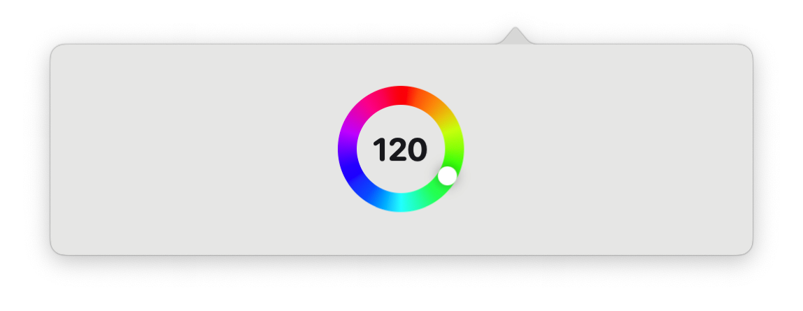

# [EasyYeelight](https://github.com/xs0521/EasyYeelight) 

> easy to operate support yeelight bulbs, Unofficial software




## Support

System Support：

## Download

The latest official **installers** and **portable versions** for macOS can be found at [Github Releases](https://github.com/xs0521/EasyYeelight/releases) page.

## Install

#### Application Signing

*EasyYeelight* is not signed (due to its costs) so you will need to use a workaround for the first run. The workaround depends on if you're running an Intel or Apple Silicon chip.

- **Intel Chips**: [Open a Mac app from an unidentified developer](https://support.apple.com/guide/mac-help/open-a-mac-app-from-an-unidentified-developer-mh40616/mac).
- **Apple Chips**: Open a terminal and run this command:

```
    sudo xattr -r -d com.apple.quarantine /Applications/EasyYeelight.app
```

## Feedback

Find a bug or have a feature request? Please file an <a href="https://github.com/xs0521/EasyYeelight/issues" targe="_blank">issue</a>!

## Features

- [x] open
- [x] brightness
- [x] colors
- [ ] scene
- [ ] music
- [ ] flow mode

## Update

2024-01-02

- colors

2023-10-29

- open
- brightness

## Thanks

Logo by [Izumi](https://unsplash.com/@itsaizumi?utm_content=creditCopyText&utm_medium=referral&utm_source=unsplash) on [Unsplash](https://unsplash.com/photos/lighted-orange-cfl-bylb-HfVfXJjktWw?utm_content=creditCopyText&utm_medium=referral&utm_source=unsplash)  


